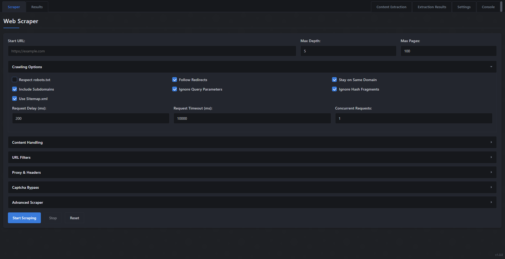
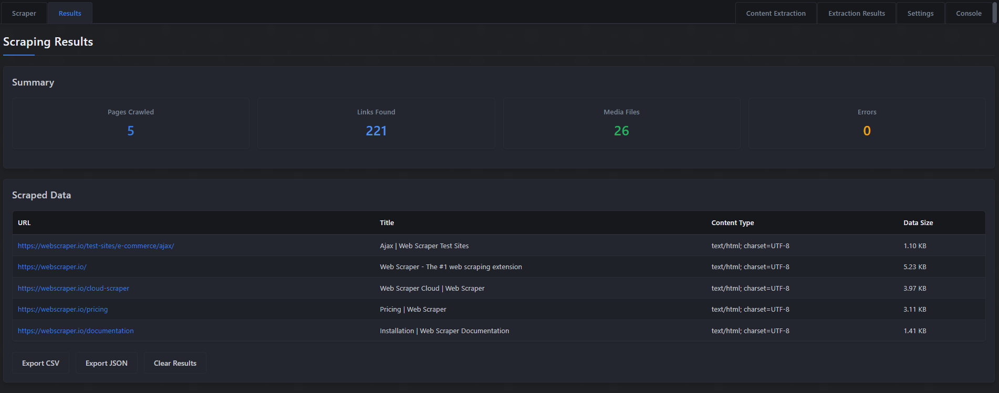

# Travel.Co Web-Scraper

A HTML, CSS, & Info Scraping desktop app built with Electron and Puppeteer. Built for company use only.

## Usage

1. **Configure Your Scraper**:
   - Enter starting URL
   - Set crawl depth and limits
   - Toggle any scraping method you desire

2. **Define Extraction Rules**:
   - Use CSS selectors to specify what data to extract
   - Set up data transformations if needed
   - Toggle any other options you see fit

3. **Run Scraper**:
   - Monitors progress in real-time via console
   - View results as they are collected

4. **Export Results**:
   - Save data in your preferred format
   - Compatible with spreadsheets

5. **To View All Scraped Data - You Must Export It**
   - Depending on your scraping needs, the data can fill 100k+ lines/rows
   - The best way to view this is to export as a .CSV and import it into a spreadsheet


I'm currently working to update the results table to handle everything.

## Screenshots




## Features:

## Core Scraping Features
- **Multi-Tab Interface**: Modern tabbed UI with Scraper, Results, Content Extraction, and Settings sections
- **Basic Scraping**: Configure and run simple web scraping operations
- **Advanced Scraping**: Configure detailed extraction rules for specific content types
- **Content Extraction**: Specialized extraction for emails, pricing, and other specific data
- **Real-time Results**: See scraping results update as they're being collected

## Crawling Configuration
- **Depth Control**: Set maximum crawl depth and page limits
- **Domain Filtering**: Option to stay within a specific domain or include subdomains
- **URL Pattern Matching**: Include or exclude URLs based on pattern matching
- **Robots.txt Compliance**: Option to respect or ignore robots.txt rules
- **Sitemap Crawling**: Automatically discover and crawl website sitemaps
- **Query Parameter Handling**: Option to ignore query parameters in URLs
- **Hash Fragment Filtering**: Option to ignore hash fragments in URLs

## Advanced Options
- **Proxy Support**: Rotate through proxy servers to avoid rate limiting
- **Custom Headers**: Set custom HTTP headers for requests
- **User-Agent Rotation**: Change user agents between requests
- **Request Throttling**: Set delays between requests to avoid overwhelming servers
- **Dynamic Content Rendering**: Handle JavaScript-rendered content using headless browser
- **Media Download**: Option to download images, videos, and other media
- **Concurrency Control**: Set number of concurrent requests for faster scraping

## Captcha Bypass
- **Multiple Bypass Strategies**: Auto, headless emulation, user-agent spoofing
- **External Service Integration**: Support for 2Captcha, AntiCaptcha, CapMonster
- **Cookie Management**: Preserve and manage cookies between requests
- **Canvas Fingerprint Spoofing**: Avoid browser fingerprinting detection

## Data Extraction
- **Custom CSS Selectors**: Extract content using specific CSS selectors
- **Content Cleaning**: Options to remove scripts, styles, comments, and normalize whitespace
- **Metadata Extraction**: Extract page metadata like title, description, etc.
- **Structured Data Extraction**: Parse JSON-LD and other structured data formats

## Advanced Extraction
- **Pagination Handling**: Automatically navigate through paginated content
- **Infinite Scroll Support**: Handle infinite scrolling pages
- **Form Authentication**: Log in to websites to access protected content
- **Data Transformation**: Options for trimming, normalizing, and sanitizing extracted content

## Export Options
- **Multiple Formats**: Export results as CSV or JSON
- **Custom Export Paths**: Select where to save exported data
- **Progress Tracking**: Monitor export progress

## User Interface
- **Theme Switching**: Switch between different visual themes
- **Real-time Logging**: Detailed logs of the scraping process
- **Log Filtering**: Filter logs by severity level
- **Collapsible Sections**: Organize settings in collapsible panels
- **Summary Statistics**: View counts of pages crawled, links found, and errors

## Performance Features
- **Request Timeout Control**: Set timeouts for HTTP requests
- **Browser Timeout Control**: Set timeouts for browser-based operations
- **Retry Mechanism**: Automatically retry failed requests
- **Headless Mode**: Option to run browser in headless mode for better performance
- **Resource Blocking**: Block unnecessary resources like images or scripts for faster scraping

## Structure

```
TravelCoWebScrape/
├── src/
│   ├── main.js                  
│   ├── main.html                
│   ├── renderer.js                     
│   ├── styles/                  
│   │   ├── dark.css             
│   │   ├── neon.css     
│   │   └── default.css        
│   ├── utils/                   
│   │   ├── advanced-scraper.js  
│   │   ├── basic-scraper.js     
│   │   ├── captcha.js           
│   │   ├── crawler.js           
│   │   └── manual-scraper.js    
│   └── results-tab/             
│       ├── results.js
│       ├── results.css
│       └── results.html      
│       
├── .gitignore                   
└── package.json     
```

## Technologies

- Electron
- Puppeteer
- Node.js
- JavaScript/HTML/CSS

## License

Travel Co. Web-Scraper is proprietary software licensed exclusively to paying clients, with all rights reserved by Leviathan M.

## Acknowledgments

- [Puppeteer](https://pptr.dev/) for browser automation
- [Electron](https://www.electronjs.org/) for cross-platform desktop application framework

---

*Created by Leviathan M*
